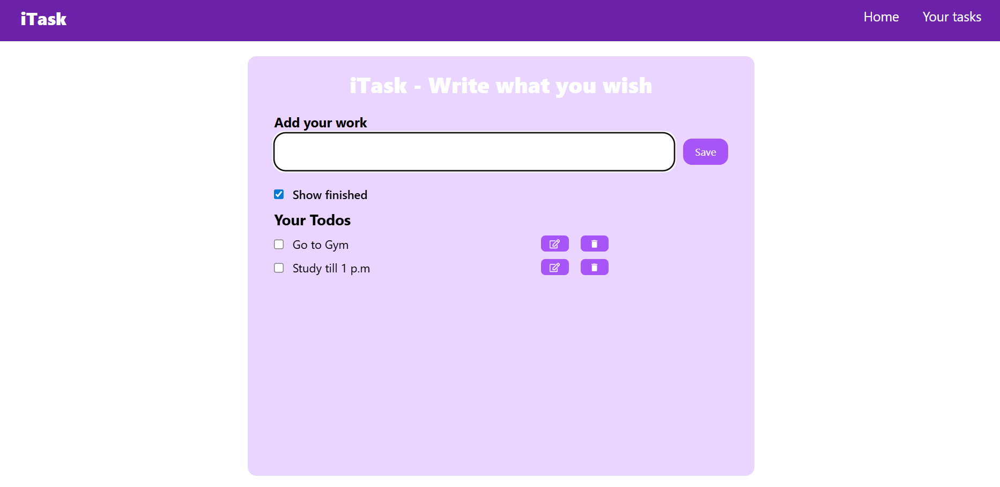

# iTask 📝

**iTask** is a simple and efficient **To-Do List Manager** built with **ReactJS** and **Tailwind CSS**.  
It helps you stay organized by keeping track of your daily tasks with options to add, edit, delete, and manage visibility with ease.  

## ✨ Features
- ➕ **Add Tasks** – Create new to-do items quickly.  
- ✏️ **Edit Tasks** – Update existing tasks whenever needed.  
- ❌ **Delete Tasks** – Remove tasks you no longer want to keep.  
- 👁️ **Toggle Visibility** – Hide or show tasks with a simple toggle.  
- 🎨 **Modern UI** – Clean, responsive, and aesthetic interface powered by **Tailwind CSS**.  

## 🛠️ Tech Stack
- **Frontend**: ReactJS  
- **Styling**: Tailwind CSS  

## 📸 Screenshots

